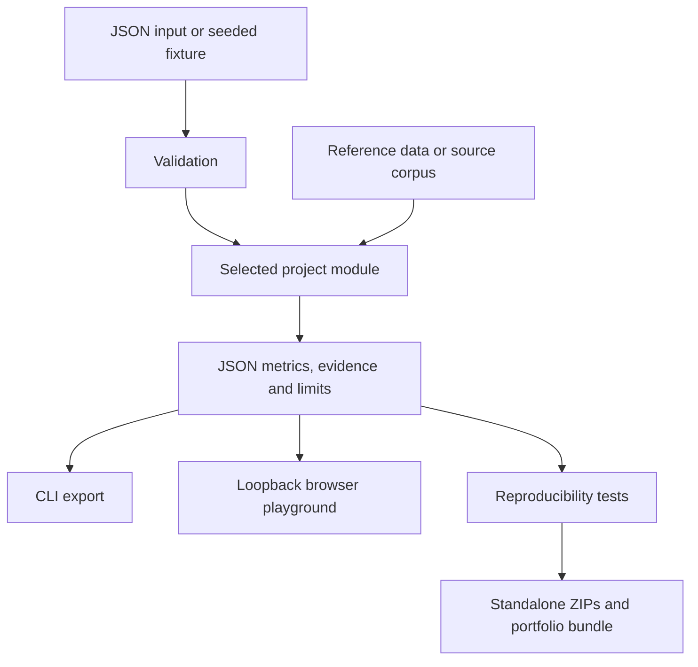

# Architecture

The portfolio is a monorepo containing ten independently runnable experiments. Shared validation, CLI, local UI and packaging reduce duplication; project algorithms remain separate Python modules. The release builder extracts one project plus the shared runtime into each standalone ZIP.

## Boundaries

The default path is CPU-only and offline after dependencies are installed. The only optional model-provider integration is a loopback Ollama request for Repair Agent. The web playground cannot activate this adapter. There is no infrastructure control plane, shell executor, paid API integration or automatic remediation.

## Method distinctions

Evidence Gate, Budget RAG and Research Lens use lexical information-retrieval methods, not semantic entailment models. Repair Agent's default repairer is deterministic. Incident Room uses statistical analyst modules, not autonomous multi-agent debate. GPU Guard and Incident Room fit unsupervised anomaly models. Inference Twin trains a random-forest surrogate on its own queue simulations. Topology RCA performs Bayesian inference with explicit assumed likelihoods or user-supplied labeled cases. Drift Radar includes statistical tests and a supervised domain classifier. EvalForge evaluates saved outputs; it does not generate answers.

## Known tradeoffs

Small dependencies and inspectable implementations make the demos easy to run but limit realism. JSON matrices are portable but not a scalable telemetry pipeline. Synthetic data permits reproducible examples but cannot demonstrate real operational impact. A local HTTP server is convenient for demos, not appropriate for production hosting. Float-valued results may vary slightly across dependency versions and hardware.
