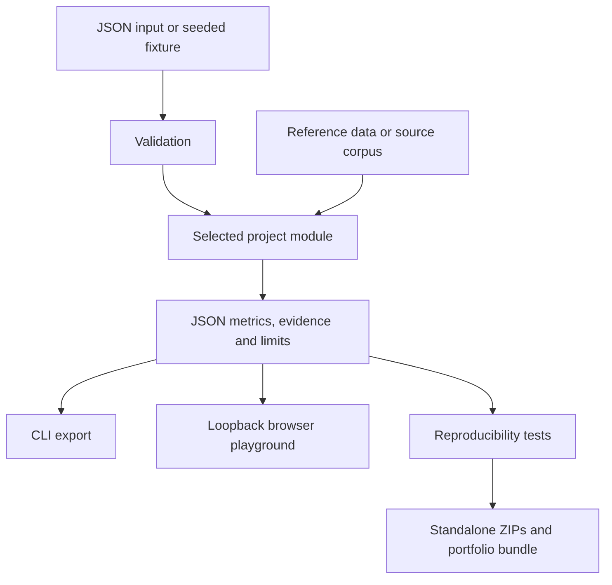

# Architecture

The portfolio is a monorepo containing thirteen independently runnable experiments. Ten modules use the shared validation, CLI, and local browser playground. Three projects run as standalone Python scripts.

| Execution path | Projects | Distribution |
|---|---|---|
| Shared runtime in `reliable_ai_lab/` | Evidence Gate, Budget RAG, Repair Agent, Incident Room, Inference Twin, GPU Guard, EvalForge, Research Lens, Topology RCA, Drift Radar | Python wheel, per-project ZIPs with the shared runtime, full source bundle |
| Standalone scripts in `projects/` | ChangeGuard, Prompt Boundary, Rollout Lab | Per-project ZIPs and full source bundle; Python standard library only |

The shared CLI, browser playground, and recorded HTML gallery expose the original ten modules. The three standalone projects have their own CLI entry points, input formats, tests, and READMEs. They are not included in the wheel.

The following flow describes the shared runtime:

The standalone scripts read a JSON input file, validate it, and write a JSON report to stdout or `--output`. Their reports contain an input fingerprint and explicit limitations. The release builder creates their ZIPs separately; the archive checker tests all thirteen project downloads.

## Boundaries

The default path is CPU-only and offline after dependencies are installed. The only optional model-provider integration is a loopback Ollama request for Repair Agent. The web playground cannot activate this adapter. There is no infrastructure control plane, shell executor, paid API integration or automatic remediation.

## Method distinctions

Evidence Gate, Budget RAG and Research Lens use lexical information-retrieval methods, not semantic entailment models. Repair Agent's default repairer is deterministic. Incident Room uses statistical analyst modules, not autonomous multi-agent debate. GPU Guard and Incident Room fit unsupervised anomaly models. Inference Twin trains a random-forest surrogate on its own queue simulations. Topology RCA performs Bayesian inference with explicit assumed likelihoods or user-supplied labeled cases. Drift Radar includes statistical tests and a supervised domain classifier. EvalForge evaluates saved outputs; it does not generate answers.

ChangeGuard traverses downstream dependencies and checks operator-supplied rollout and rollback constraints. Its weighted exposure is not failure probability. Prompt Boundary scores saved traces for tool names outside an allowlist and literal synthetic marker leakage; it does not run a model or prevent injection. Rollout Lab compares baseline and canary windows using Wilson intervals and sampled p95 latency guardrails; its outputs are recommendations, not deployment actions.

## Known tradeoffs

Small dependencies and inspectable implementations make the demos easy to run but limit realism. JSON matrices are portable but not a scalable telemetry pipeline. Synthetic data permits reproducible examples but cannot demonstrate real operational impact. A local HTTP server is convenient for demos, not appropriate for production hosting. Float-valued results may vary slightly across dependency versions and hardware.
